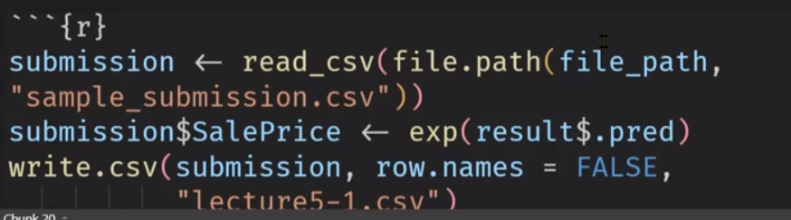

```{r setup, include=FALSE}
knitr::opts_chunk$set(echo = TRUE)
```

#### library

```{r}
library(tidymodels)
library(tidyverse)
library(magrittr)
library(skimr)
library(knitr)
```

## 1교시 : β 줄이기(변수선택) ------------------------

입력 변수의 수를 줄였을때의 장점 \
 - 잡음(noise)를 제거해 모형의 정확도를 개선함 \
 - 모형의 연산 속도가 빨라짐 \
 - 다중공선성의 문제를 제거해 모형의 해석 능력을 향상시킴 \
    ex) 나이, 생년은 같은 의미를 갖기 때문에 하나를 제거함 \
 - 계수축소법에는 Ridge와 LASSO, Elastic Net이 있음

### 1.1] Ridge(능선) regression
 - L2 norm(제곱합) 으로 표현 \
 - **λ가 클수록 β값들이 0으로 수렴** 

- f(β;x,y) = (Y-Xβ)^T \* (Y-Xβ) + λ\*β^T \* I * β \
             (단, X = 1더해진 x메트릭스)
- hat β(Ridge) = (X^T * X + λ\*I)^{-1} * X^T * Y 

### 1.2] LASSO regression
 - (Least Absolute Shrinkage and Selection Operator) \
 - L1 norm(절대값 합) 으로 표현 \
 - **λ가 클수록 β값들이 0이 됨** 

- f(β;x,y) = (Y-Xβ)^T \* (Y-Xβ) + λ\*│β│ \
- hat β(LASSO) 수식으로 구하기 어려움
\

#### 공통점
 - 계수축소법으로 잔차와 회귀계수를 최소화하는 최적화 문제임 \
 - 즉 min SSE + f(β)의 목적함수를 푸는 문제임 \

#### 차이점
- Ridge는 계수가 0에 가깝게 축소되는데 비해 \
  LASSO는 계수가 0으로 축소됨
- Rigde는 X가 전반적으로 비슷한 수준으로 영향을 미칠때 사용 \
  LASSO는 X마다 영향력 편차가 큰 경우에 사용

```{r, out.width="70%"}

```


### 1.3] Elastic Net
 - L1 norm(절대값 합) L2 norm(제곱합) 둘 다 사용 \
 - R에서는 λ와 α를 써서 변형된 모델로 사용 \
- f(β;x,y) = (Y-Xβ)^T \* (Y-Xβ) + λ\*│β│ \ + λ\*β^T \* β \

```{r, out.width="70%"}
knitr::include_graphics("lec6-2.png")
```

## 2~3교시 : β 줄이기(변수선택) 실습 ------------------------

### 2.1] Ridge regression 의 λ에 따른 beta값 변화 예시

```{r}
X <- as.matrix(mtcars[,2:10])
X <- cbind(1, X)

Y <- mtcars[,1]

beta <- solve(t(X) %*% X) %*% t(X) %*% Y
beta 

lambda <- 0

beta_r0 <- solve(t(X) %*% X + lambda*diag(ncol(X))) %*% t(X) %*% Y
beta_r0

lambda <- 0.5
beta_r0.5 <- solve(t(X) %*% X + lambda*diag(ncol(X))) %*% t(X) %*% Y
lambda <- 1
beta_r1 <- solve(t(X) %*% X + lambda*diag(ncol(X))) %*% t(X) %*% Y
lambda <- 10
beta_r10 <- solve(t(X) %*% X + lambda*diag(ncol(X))) %*% t(X) %*% Y
lambda <- 100
beta_r100 <- solve(t(X) %*% X + lambda*diag(ncol(X))) %*% t(X) %*% Y
lambda <- 1000
beta_r1000 <- solve(t(X) %*% X + lambda*diag(ncol(X))) %*% t(X) %*% Y
lambda <- 10000
beta_r10000 <- solve(t(X) %*% X + lambda*diag(ncol(X))) %*% t(X) %*% Y

beta_set <- cbind(beta_r0, beta_r0.5, beta_r1, beta_r10, beta_r100, beta_r1000, beta_r10000)

beta_set

```
##### 항등행렬 만들기 : diag(행개수, 열개수)
- 행, 열 하나만 써도 됨, ncol()를 이용하면 편함
- 위에서 X를 10개 열로 만들어 놔서 항등행렬이 아래와 같음

```{r}
diag(ncol(X))
```

##### LASSO regression은 어려움. 절대값 처리하는 스킬 필요함.
\

### 2.2] train 세트를 나눠서 λ를 결정하기

- train 을 학습용과 validation set(나머지)으로 나누기 \
- 학습용에서 λ 후보들을 만들고, validation에서 λ 최종확정 \

```{r out.width="50%"}
knitr::include_graphics("lec6-3.png")
```

##### validation set 나누기 : validation_split()


```{r}
validation_split <- validation_split(mtcars, prop = 0.7)
validation_split
# 실제 내용을 보려면, 
validation_split$splits[[1]]$in_id
head(validation_split$splits[[1]]$in_id)
```

##### tunning 
###### - penalty = tune() : λ
###### - mixture = tune() : α (tune()자리에 0을 넣으면 ridge됨)

```{r}
tune_spec <- linear_reg(penalty = tune(),
                        mixture = 0) %>%
  set_engine("glmnet")

# 0~1까지 람다를 균등하게 50개 뽑기
param_grid <- grid_regular(penalty(), levels = 50)
                           #mixture(),
                           #levels = list(penalty =100,
                                         #mixture = 10))
param_grid
```

##### workflow() 만들기 : 학습하고 평가하는 모델
```{r}
workflow <- workflow() %>% 
  add_model(tune_spec) %>%
  add_formula(mpg ~ .)
```

##### tunning 하기 : λ, α

```{r}
library(tictoc)
doParallel::registerDoParallel()

tic()
tune_result <- workflow %>%
  tune_grid(validation_split, 
            grid = param_grid, 
            metrics = metric_set(rmse))
toc()


```
```{r}
tune_result %>%
  collect_metrics()
```

##### Visualization of the tunning result
```{r}
tune_best <- tune_result %>% select_best(metric = "rmse")
tune_best$penalty
# tune_best$mixture
tune_result %>% show_best()
```
##### plot
```{r, out.width="50%"}
knitr::include_graphics("lec6-4.png")

```


##### 전체 데이터로 모델 적용시키고

```{r, out.width="50%"}

```


##### 예측

```{r, out.width="50%"}
knitr::include_graphics("lec6-7.png")
```

##### 제출할 파일 생성

```{r, out.width="50%"}

```


### validation이 우연히 잘못 뽑히면 망한다?
### -> cross validation 으로 해결

```{r, out.width="50%"}
knitr::include_graphics("lec6-9.png")
```


##### 10개로 validation을 나누기 : vfold_cv()
- 10개, 가격이 골고루 담기도록 strata = 가격 
```{r, out.width="50%"}

```

##### mixture를 살려서 돌리기 :
- tune_spec과 param_grid에서 mixture살리고, level을 맞춤
- 크면 오래걸리니까 패널티는 100개, mixtuer는 5개만
- 나머지 부분은 그대로(mixture=0만 패널티처럼 수정)

```{r, out.width="50%"}

```


## 점수를 올려보자 ------------

### 3.1] outlier 제거 : filter() 

```{r, out.width="50%"}

```

### 3.2] group mean값을 구해서 새로운 변수로 활용하자!

```{r, out.width="50%"}

```


