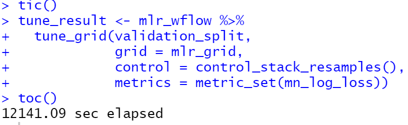
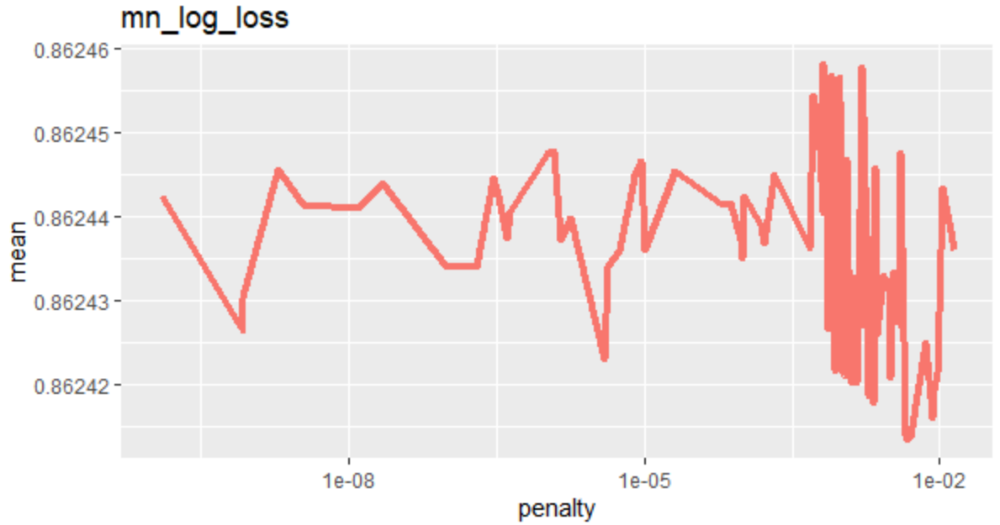

```{r setup, include = FALSE}
library(tidymodels)
library(tidyverse)
library(magrittr)
library(tictoc)
library(skimr)
library(kknn)
library(stacks)
library(glmnet)
library(kernlab)
library(keras)
library(ranger)
library(purrr) ; library(magrittr) ; library(MASS)
library(knitr)
# set default options
opts_chunk$set(echo = FALSE,
               fig.width = 7.252,
               fig.height = 4,
               dpi = 300)

# uncomment the following lines if you want to use the NHS-R theme colours by default
# scale_fill_continuous <- partial(scale_fill_nhs, discrete = FALSE)
# scale_fill_discrete <- partial(scale_fill_nhs, discrete = TRUE)
# scale_colour_continuous <- partial(scale_colour_nhs, discrete = FALSE)
# scale_colour_discrete <- partial(scale_colour_nhs, discrete = TRUE)
```

class: title-slide, left, bottom

# `r rmarkdown::metadata$title`
----
## **`r rmarkdown::metadata$subtitle`**
### `r rmarkdown::metadata$author`
### `r rmarkdown::metadata$date`

---
# MLR


> 1. MLR?

> 2. MLR 모수추정

> 3. MLR vfold 구하기

> 4. Q&A

---

## 1. MLR? 
### Multinomial Logistic Regression, 다항 로지스틱 회귀, 다중 분류 

```{r, echo=FALSE, fig.cap="그림1", fig.align='center', out.width = '20%'}
knitr::include_graphics("../0604pt/img/MLR2.PNG")
```

▷ 로지스틱의 일종으로 선형 회귀가 아닌 **분류** 형태(범주형 회귀)

▷ 로지스틱에서 시그모이드를 써서 선형 회귀 값을 0과 1로 분류**(2항 분류)**한 것처럼,

- MLR은 **선형 회귀 값을 후처리**해서 **3개 이상**으로 분류하는 **일반화**된 형태

- 예) 수능 등급(1~9등급), 학점(A+, A, ...), 등

---

# 1. MLR? 

```{r, echo=FALSE, fig.cap="그림2", fig.align='center', out.width = '50%'}
knitr::include_graphics("../0604pt/img/softmax.PNG")
```

▷ 후처리 함수, 활성화함수(Activation function), Softmax 

---

# 1. MLR? 

▷ **(장점)** 다중 분류 용이, ML 등에 사용 **(단점)** 계수의 직관적 해석 어려움


▷ 데이콘 신용카드 대회 사례
- 성별, 차량소유, 등등의 변수에 따라 신용등급을 0, 1, 2로 분류
        1) 0인가 아닌가
        2) 1인가 아닌가
        3) 2인가 아닌가 
☞  2항 분류인 로지스틱 모델 말고 **MLR 모델을 적용**


---

# 2. MLR 모수추정

▷ 오버피팅 방지를 위한 튜닝(정규화)

   : 모수 `penalty`와 `mixture`의 최적값을 찾기

```{r, echo=TRUE}
mlr_spec <- multinom_reg(penalty = tune(),
                         mixture = tune()) %>% 
  set_engine("glmnet") %>% 
  set_mode("classification")
```

`multinom_reg()`
  > - `penalty`와 `mixture`를 `tune()`으로 세팅
  > - `penalty`: 람다(λ), 정규화를 위한 배수
  > - `mixture`: 알파(α), LASSO 비율 (1:LASSO ~ 0:Ridge)
  > - `set_engine`: glmnet package안에 있는 multinom_reg을 사용
  > - `set_mode`: classification 문제


---

# 2. MLR 모수추정

▷ 튜닝에 들어갈 `penalty`와 `mixture`의 샘플 만들기

```{r, echo=TRUE}
set.seed(2021)
mlr_grid <- grid_latin_hypercube(penalty(), mixture(),  size = 100)
```

`grid_latin_hypercube()`
  > - seed를 고정 : 고정을 하지 않으면 그리드가 바뀌어서 다시 돌릴때 최적값이 바뀌는 경우 발생
      
  > - 100개의 `penalty`와 `mixture` 샘플을 임의로 생성

---

# 2. MLR 모수추정

▷ workflow 설정

```{r, echo=TRUE}
mlr_wflow <- 
  workflow() %>% 
  add_model(mlr_spec) %>%
  add_formula(credit ~ .)
```

```{r}
mlr_wflow

```

---

# 2. MLR 모수추정
▷ 튜닝하기 

.pull-left[
```{r, echo=FALSE, fig.cap="100개", fig.align='center', out.width = '100%'}
knitr::include_graphics("../0604pt/img/tune_mlr.PNG")
```
]
.pull-right[
```{r, echo=FALSE, fig.cap="1000개", fig.align='center', out.width = '100%'}

```
]
  > - `metrics` : 최적값 평가 지표는 mean log loss
  
---

# 2. MLR 모수추정

▷ 튜닝결과 

```{r, echo=FALSE, fig.cap="", fig.align='center', out.width = '70%'}
knitr::include_graphics("../0604pt/img/tune_result2.PNG")
```

---

# 2. MLR 모수추정

▷ 튜닝결과 plot
.pull-left[
```{r, echo=FALSE, fig.cap="", fig.align='center', out.width = '100%'}
knitr::include_graphics("../0604pt/img/tune_result_plot.PNG")
```
]
.pull-right[
```{r, echo=FALSE, fig.cap="", fig.align='center', out.width = '100%'}

```
]


---

# 2. MLR 모수추정

▷ 튜닝결과 최적값

- 최적값 : `penalty` = 0.00548831, `mixture` = 0.0993676
   
- `mn_log_tune_best`에 저장

```{r, echo=FALSE, fig.cap="", fig.align='center', out.width = '70%'}
knitr::include_graphics("../0604pt/img/tune_mlr_best.PNG")
```


---

# 3. MLR vfold 구하기

▷ 최적값을 가지고 학습하기

```{r, echo=FALSE, fig.cap="", fig.align='center', out.width = '70%'}
knitr::include_graphics("../0604pt/img/mlr_fit.PNG")
```

---

# 4. Q&A

▷ 어떤 변수가 신용등급 산정에 주요한 영향을 미치는가?

- 학습한 mlr_fit_vfold 모델의 coefficient값을 확인하는 방법은?

▷ grid 실행때마다 값이 리뉴얼되는 문제, 항상 setseed()와 같이 돌려야 하는지?
- size = 100에서는 tune_best가 변하는 경우 발생
  (최적 패널티는 변하는데 mean은 0.862로 변화없음)
☞ setseed(2021)과 grid를 같이 실행
- size를 1000개로 늘리면 seed고정 없이도 튜닝이 안정적일 수는 있지만, 튠 시간이 대폭 증가


    
---

## 참고 및 출처

▶ 참고사이트

 - https://blog.naver.com/hobbang143/221735605346
 - https://blog.naver.com/pmw9440/222001218822
 - https://blog.naver.com/jjy0501/221640825506
 - https://lmlcr.gagolewski.com/shallow-and-deep-neural-networks.html

▶ 그림 출처

 - 그림1 :  https://www.cntk.ai/pythondocs/CNTK_103B_MNIST_LogisticRegression.html
 - 그림2 : 
https://lmlcr.gagolewski.com/shallow-and-deep-neural-networks.html