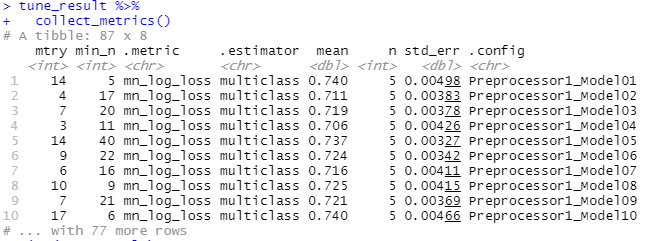
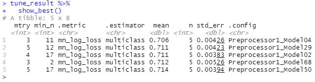
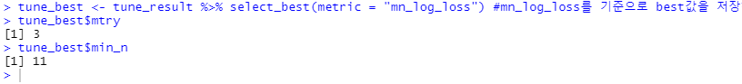
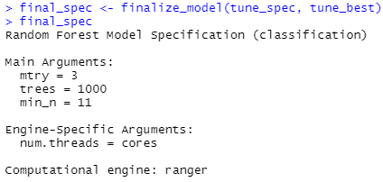

```{r setup, include = FALSE}
library(knitr)
library(tidyverse)
library(tidymodels)
library(tidyverse)
library(magrittr)
library(skimr)
library(kknn)
library(stacks)
library(glmnet)
library(xgboost)
library(kernlab)
library(keras)
library(ranger)
library(purrr) ; library(magrittr) ; library(MASS)
library(xaringan)
library(xaringanthemer)
# library(nhsrtheme)
# set default options
opts_chunk$set(echo = FALSE,
               fig.width = 7.252,
               fig.height = 4,
               dpi = 300)

# uncomment the following lines if you want to use the NHS-R theme colours by default
# scale_fill_continuous <- partial(scale_fill_nhs, discrete = FALSE)
# scale_fill_discrete <- partial(scale_fill_nhs, discrete = TRUE)
# scale_colour_continuous <- partial(scale_colour_nhs, discrete = FALSE)
# scale_colour_discrete <- partial(scale_colour_nhs, discrete = TRUE)
```


```{r, include = FALSE}
train <- read_csv("train.csv") %>% 
  janitor::clean_names()
test <- read_csv("test.csv") %>% 
  janitor::clean_names()


train %<>%
  mutate_if(is.character, as.factor) %>% 
  mutate(credit = factor(credit))


test %<>%
  mutate_if(is.character, as.factor)


credit_recipe <- train %>% 
  recipe(credit ~ .) %>%
  step_mutate(yrs_birth = -ceiling(days_birth/365), 
              yrs_employed = -ceiling(days_employed/365), 
              perincome = income_total / family_size, 
              adult_income = (family_size - child_num) * income_total, 
              begin_month = -begin_month) %>% 
  step_rm(index, days_birth, work_phone, phone, email) %>%  
  step_unknown(occyp_type) %>% 
  step_zv(all_predictors()) %>% 
  step_integer(all_nominal(), -all_outcomes()) %>% 
  step_center(all_predictors(), -all_outcomes()) %>% 
  prep(training = train)


train2 <- juice(credit_recipe)
test2 <- bake(credit_recipe, new_data= test)


set.seed(2021)

validation_split <- vfold_cv(train2, v = 5, strata = credit)
```

class: title-slide, left, bottom

# `r rmarkdown::metadata$title`
----
## **`r rmarkdown::metadata$subtitle`**
### `r rmarkdown::metadata$author`
### `r rmarkdown::metadata$date`

---
class: inverse, left

# Random Forest


> 1. Random Forest?

> 2. Random Forest 모수추정

> 3. Random Forest vfold 구하기

---
# 1. Random Forest?

```{r, echo=FALSE, fig.cap="", fig.align='center', out.width = '60%'}
knitr::include_graphics("../6_4_presentation/img/random_forest.PNG")
```

▷ 고려할 변수들을 랜덤(Bagging)으로 골라서 각각 tree를 만든다

▷ Voting을 통해서 최종 예측
  - Hard Voting: 각 트리의 예측 결과를 투표를 통해 최종적으로 예측(classification data)
  
  - Soft Voting: 각 트리에서 결정확률의 평균이 가장 높은 것으로 예측(continuous data)

---
# 1. Random Forest?

**장점**
  - Bagging으로 tree를 만들기 때문에 오버피팅을 방지 할 수 있음
  
  - 예측 성능이 좋다(점수가 제일 높게 나옴)


**단점**
  - 사용할 모수(`mtry`, `min_n`)를 구하는데 시간이 오래걸림


---
# 2. Random Forest 모수추정

random forest 사용할 때는 **튜닝 스펙**을 설정해야한다
```{r, include = FALSE}
cores <- parallel::detectCores() -1
cores
```
```{r, echo=TRUE}
tune_spec <- rand_forest(mtry = tune(),
                         min_n = tune(),
                         trees = 1000) %>% 
  set_engine("ranger", num.threads = cores) %>% set_mode("classification")
```

`tune_spec`: 모수를 어떻게 선택하는게 좋을지 best를 정하기

`rand_forest()`
  > - `mtry = tune()`: tree를 만들때 몇 개의 변수를 고려하는 것이 best인가. 열에서 종속변수를 제외하고 선택할  변수의 수
  > - `min_n = tune()`: terminal node에 몇개가 남을때까지 split하는게 best인가
  > - `trees`: 1000개의 tree를 사용

---
# 2. Random Forest 모수추정

```{r, echo=TRUE}
tune_spec <- rand_forest(mtry = tune(),
                         min_n = tune(),
                         trees = 1000) %>% 
  set_engine("ranger",
             num.threads = cores) %>% set_mode("classification")
```

`rand_forest()`
  > - `set_engine`: ranger package안에 있는 random forest를 사용
  
  > - `set_mode`: classification 문제
  
---
# 2. Random Forest 모수추정
각 설정된 `param_grid`안에 위에서 설정한 1000개의 tree가 들어있다!

```{r, echo=TRUE}
param_grid <- grid_random(finalize(mtry(), 
                                   x = train2[,-1]), 
                          min_n(), size = 100)


param_grid %<>% filter(mtry >= 3)

```


- `grid_random`: `mtry`, `min_n`의 랜덤한 조합을 `size = 100`개의 tibble로 만든다

- `filter`: `mtry`가 3이상인것만 선택


---
# 2. Random Forest 모수추정

```{r, echo=TRUE, message=TRUE}
workflow <- workflow() %>% add_model(tune_spec) %>% add_formula(credit ~ .)
```
```{r}
workflow

```

---
# 2. Random Forest 모수추정

시간 오래 걸림(생략)
.pull-left[
```{r, echo=TRUE}
#library(tictoc)
#tic()
#tune_result <- workflow %>% 
# tune_grid(validation_split,
#     grid = param_grid,
#     metrics = metric_set(mn_log_loss))
# toc()
```
]
.pull-right[
  ▶ `tune_grid`: 알맞은 최적의 grid(parameter)를 찾아라 
  
  ▶  `validation_split`: cross validation 한 5개의 fold 각각에
  
  ▶  `grid`: `mtry`, `min_n`의 랜덤한 조합을 100개의 tibble을 적용해서
  
  ▶  최적의 값을 평가하는 지표는 mean log loss를 사용하라
]

---
# 2. Random Forest 모수추정

**튜닝결과**

```{r, echo=TRUE}
# tune_result %>%
#   collect_metrics()
```

```{r, echo=FALSE, fig.cap="", fig.align='center', out.width = '80%'}

```

---
# 2. Random Forest 모수추정

**튜닝결과**

```{r, echo=TRUE}
# tune_result %>%
#   show_best()

```

```{r, echo=FALSE, fig.cap="", fig.align='center', out.width = '80%'}

```
---
# 2. Random Forest 모수추정

**튜닝결과 시각화**

```{r, echo=FALSE, fig.cap="", fig.align='center', out.width = '50%'}
knitr::include_graphics("../6_4_presentation/img/Rplot.PNG")
```

.center[▶ `mtry = 3`일 때 mean log loss가 제일 작음]

---
# 2. Random Forest 모수추정

최적의 값을 찾았으면 best인 parameter의 값(mtry, min_n)을 mean log loss를 기준으로 best를 저장 (mn_log_loss 기준 best → `mtry` : 3, `min_n` : 11)

```{r, echo=TRUE}
# tune_best <- tune_result %>% select_best(metric = "mn_log_loss")
# tune_best$mtry
# tune_best$min_n
```

```{r, echo=FALSE, fig.cap="", fig.align='', out.width = '80%'}

```

```{r, echo=FALSE, fig.cap="", fig.align='', out.width = '40%'}

```


---
# 2. Random Forest vfold 계산

```{r, echo=TRUE}
model_spec <- rand_forest(mtry = 3,
                          min_n = 11,
                          trees = 1000) %>% 
    set_mode("classification") %>% 
    set_engine("ranger", importance = "impurity")

```

  ▶ vfold로 구한 `mrty`와 `min_n`은 앞에서 구한 best 값을 사용
  
  ▶ `ranger`패키지에서 random forest를 사용
  
  ▶ classification이라서 impurity(불순도)를 중요변수로 봄
  
---
# 3. Random Forest vfold 계산
```{r, echo=TRUE}
rf_workflow <- workflow() %>%
  add_model(model_spec) %>% 
  add_formula(credit ~ .)

rf_grid <- tibble(mtry=c(3),min_n=c(11))
```
**시간이 오래 걸려서 생략**
```{r, echo=TRUE}
# library(tictoc)
# tic()
# rf_fit_vfold <-  rf_workflow %>% 
#   tune_grid(validation_split,
#             grid = rf_grid,
#             metrics = metric_set(mn_log_loss),
#             control = control_stack_resamples())
# toc()
```
